# Linux-Foundation

## This project demostrates the introduction to Linux technology, understanding Linux fundamentals such as Linux mades, navigating through folders and direction, file handling, creating virtual machine like AWS EC2, and how to update, upgrade, install and uninstall packages in AWS EC2 using Linux machine.

## AWS DASHBOARD

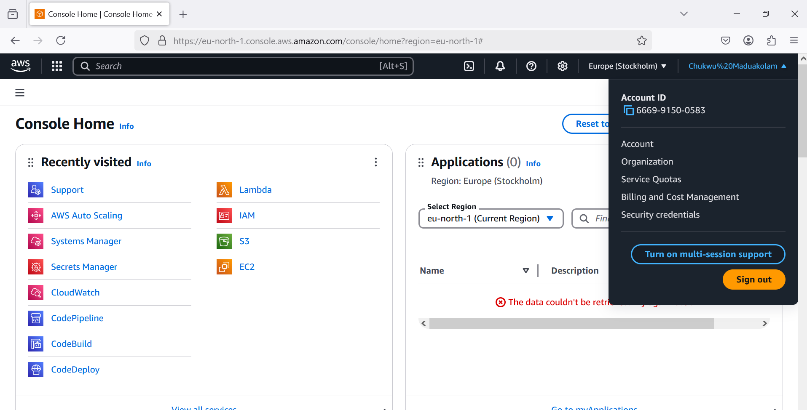

## EC2 DASHBOARD

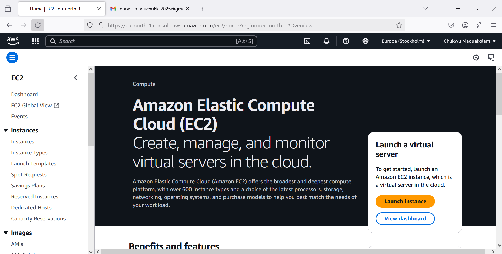

##  LINUX SERVER DASHBOARD SCREENSHOT

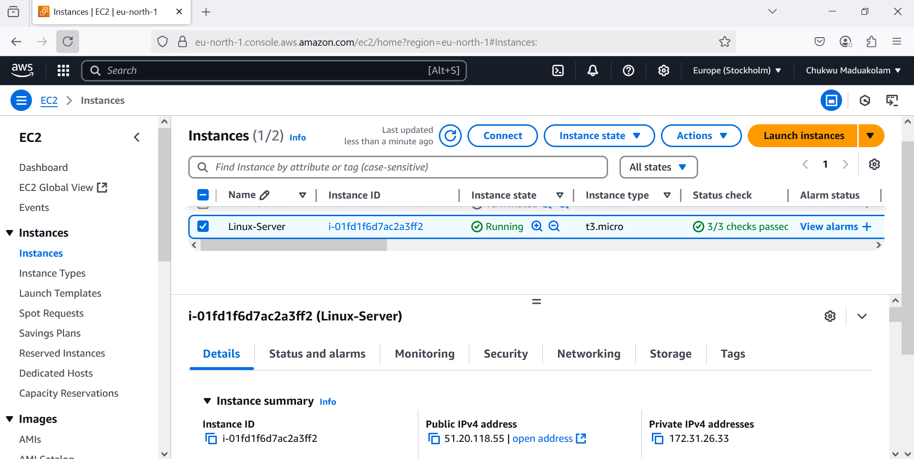

## CONNECTING TO THE EC2 SERVER USING SSH SCREENSHOT

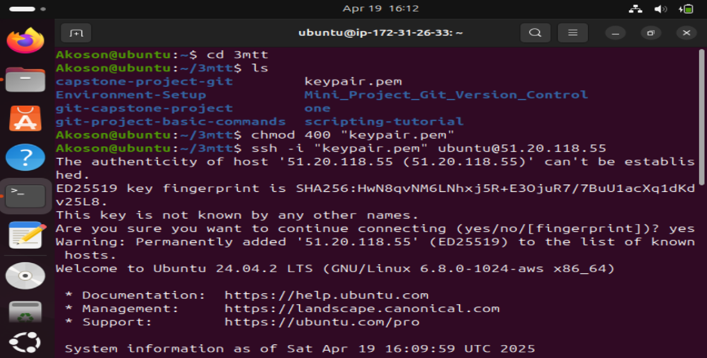

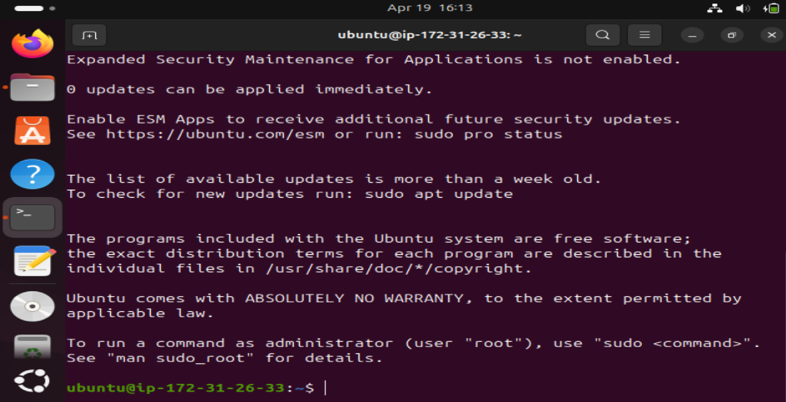

## INSTALLING, UPDATING, UPGRADING AND REMOVING PACKAGES SCREENSHOT

## UPDATING LINUX SERVER SCREENSHOT

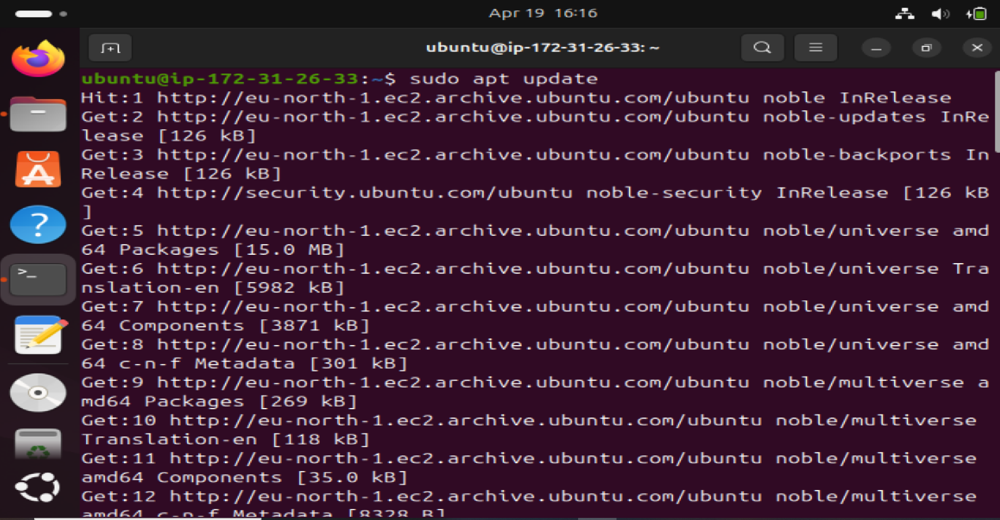

## UPGRADING CSREENSHOT

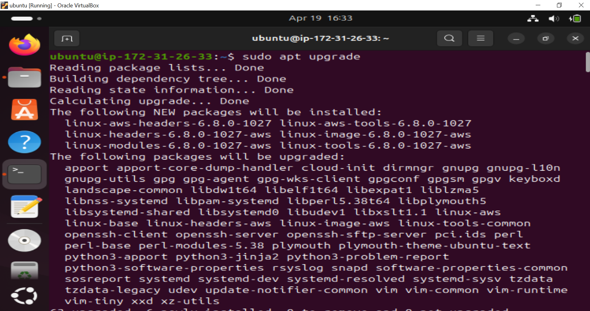

## INSTALLING TREE SCREENSHOT

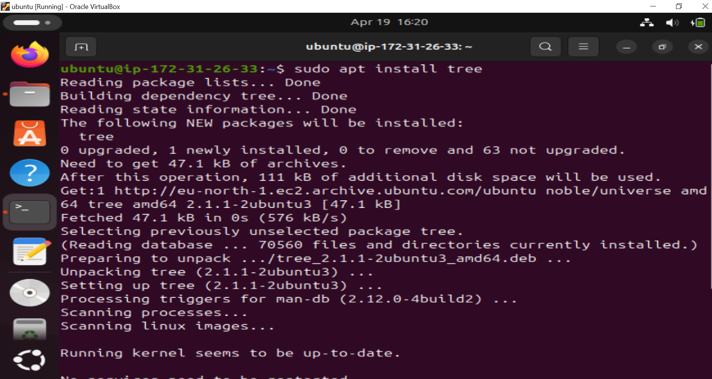

## VERIFYING TREE INSTALLATION SCREENSHOT

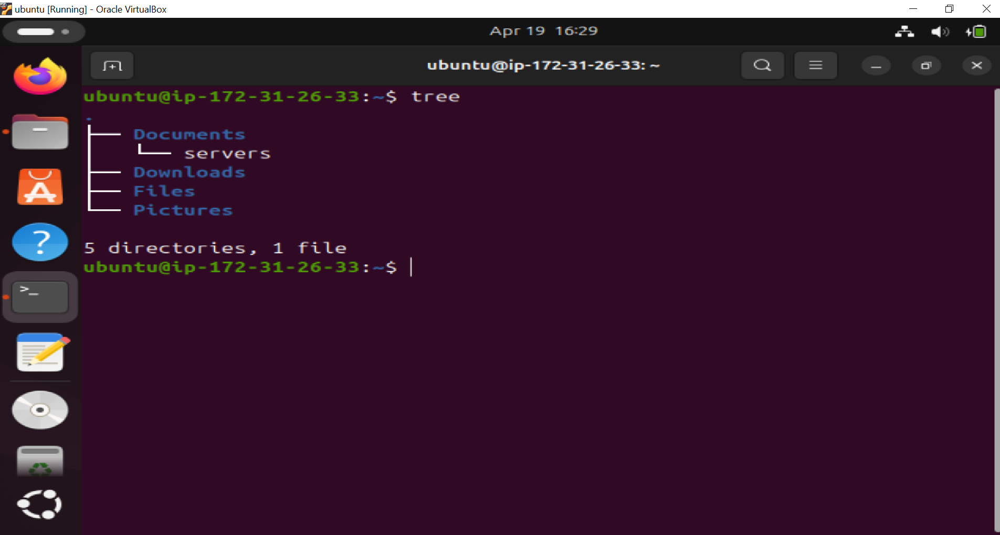

## REMOVING TREE SCREENSHOT

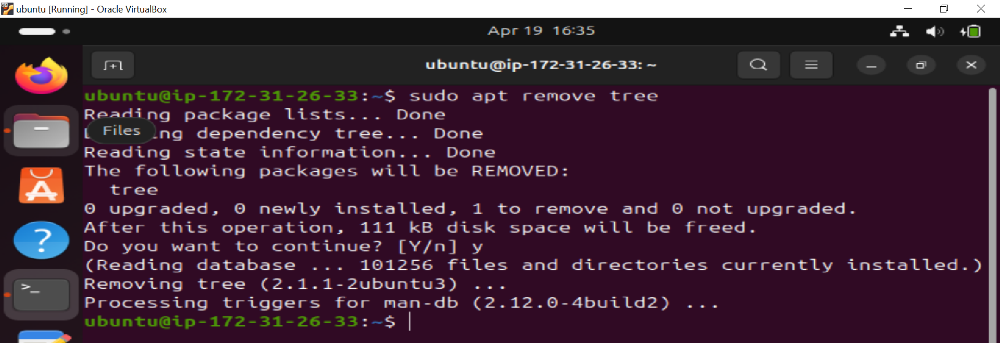

## INSTALLING NGINX SCREENSHOT

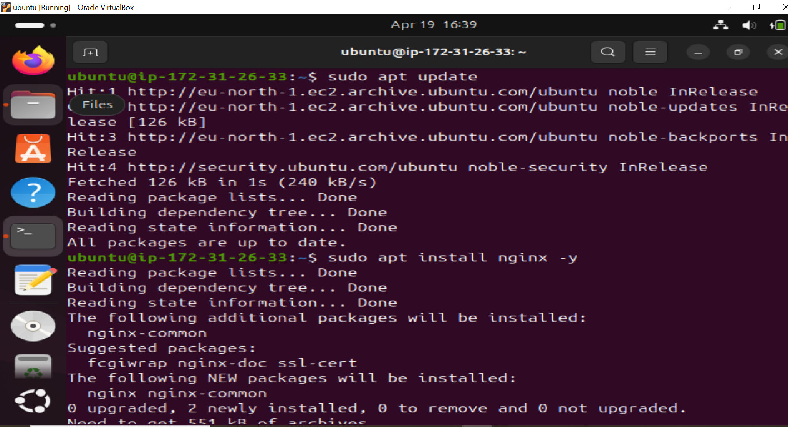

## VERIFYING NGINX INSTALLATION SCREENSHOT

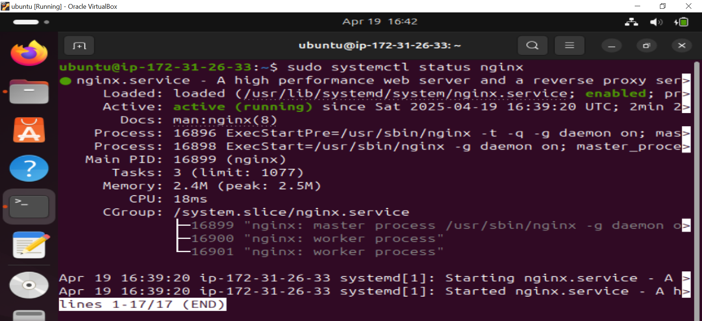

## REMOVING NGINX SCREENSHOT

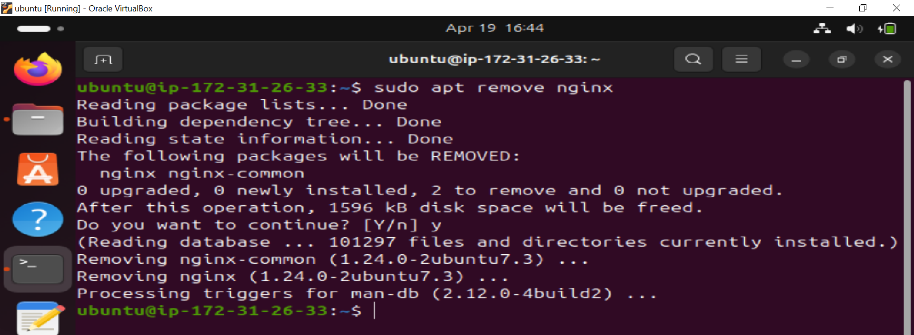

## INSTALLING PYTHON SCREEN

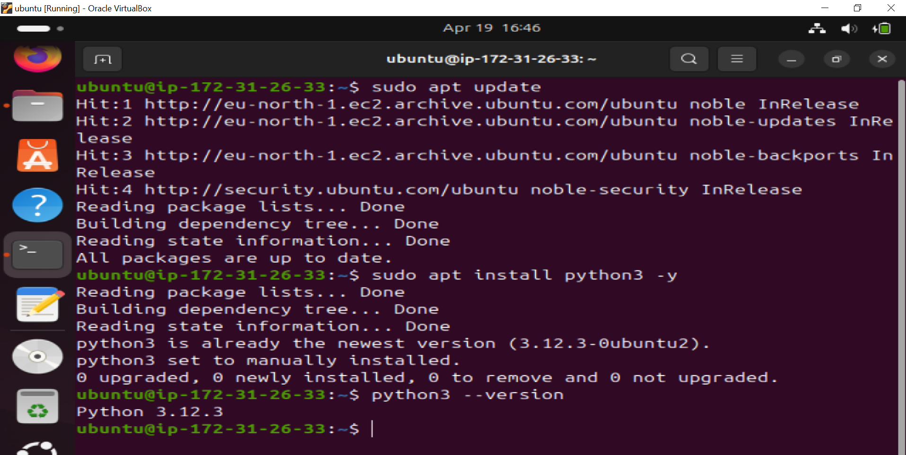

## End of Linux foundation project part-one.